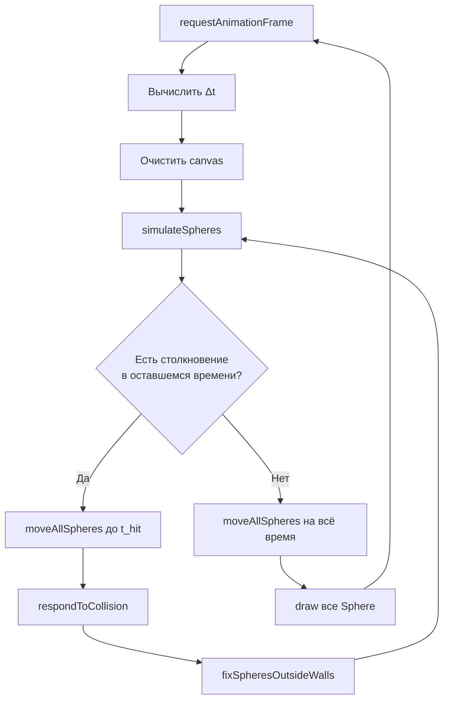

# Документация анимации Floating Spheres

Подробное описание того, как устроена и работает анимация «плавающих сфер» в проекте. Документ охватывает архитектуру, физику, математику и цикл рендеринга.

> **Словарь терминов** — на отдельной странице: [Словарь](/glossary).

## 1. Обзор

**Floating Spheres** — интерактивная 2D-анимация на HTML Canvas. На экране появляется **40 белых окружностей** (сфер), которые:

- движутся с **постоянной скоростью**;
- **отскакивают** от границ canvas;
- **сталкиваются** друг с другом и меняют направление;
- **масштабируются** под размер окна браузера.

Физика реализована не через «шаг с проверкой столкновений в конце кадра» (naive Euler), а через **событийную симуляцию** (*event-driven simulation*): за каждый кадр вычисляется **ближайшее столкновение**, симуляция продвигается ровно до этого момента, затем обрабатывается столкновение. Это даёт точные отскоки без «проваливания» объектов друг в друга или сквозь стены.

**Стек:** TypeScript, Vite, Canvas 2D API, `requestAnimationFrame`.

---

## 2. Архитектура приложения

```
Engine
├── CanvasRenderer   — canvas, resize, очистка, фон
├── Viewport         — размеры и масштаб design → pixels
└── Scene
    └── Sphere[]     — объекты сцены
```

| Класс / модуль | Назначение |
|---|---|
| `Engine` | Точка входа: создаёт renderer, viewport, scene; запускает цикл `requestAnimationFrame`. |
| `CanvasRenderer` | Управляет `<canvas>`, подписывается на `resize`, рисует фон. |
| `Viewport` | Хранит ширину/высоту canvas и коэффициент масштаба относительно эталона 800 px. |
| `Scene` | Содержит массив сфер, обновляет физику, рисует все сферы. |
| `Sphere` | Одна сфера: позиция, радиус, скорость, отрисовка, перемещение. |
| Функции `PHYSICS` | Чистая логика столкновений, отскоков, поиска ближайшего события. |

При изменении размера окна сцена **пересоздаётся** с нуля (новые случайные позиции и радиусы).

---

## 3. Конфигурация и масштабирование

### 3.1. Константы

| Константа | Значение | Смысл |
|---|---|---|
| `DESIGN_REFERENCE_SIZE` | 800 | Эталонный размер (px) для пропорционального масштабирования. |
| `SPHERE.count` | 40 | Количество сфер. |
| `SPHERE.minRadius` / `maxRadius` | 10 / 150 | Радиус в «дизайн-единицах». |
| `SPHERE.speed` | 0.3 | Скорость в «дизайн-единицах за кадр при 60 FPS». |
| `SIMULATION.referenceFramesPerSecond` | 60 | Эталонная частота кадров для пересчёта скорости. |
| `SIMULATION.maxDeltaTimeSeconds` | 0.1 | Ограничение Δt (защита от «скачка» при лаге вкладки). |
| `LAYOUT.canvasPadding` | −256 | Canvas шире/выше окна на 256 px с каждой стороны (выходит за края). |
| `PHYSICS.minCollisionTime` | 10⁻⁶ | Минимальный значимый интервал времени. |
| `PHYSICS.gapAfterContact` | 10⁻⁴ | Зазор после контакта (предотвращает залипание). |
| `PHYSICS.maxCollisionChecksPerFrame` | 16 | Максимум событий столкновений за один кадр. |
| `PHYSICS.maxOverlapFixAttempts` | 4 | Итераций исправления перекрытий. |

### 3.2. Масштаб viewport

Canvas масштабируется пропорционально меньшей стороне окна:

$$
\text{scale} = \frac{\min(\text{width}, \text{height})}{\text{DESIGN\_REFERENCE\_SIZE}}
$$

Перевод «дизайн-значения» в пиксели:

$$
\text{pixels} = \text{designValue} \times \text{scale}
$$

### 3.3. Скорость сферы в пикселях в секунду

Скорость задаётся в дизайн-единицах «на кадр при 60 FPS», затем переводится в px/s:

$$
v_{\text{px/s}} = \text{scaleToPixels}(\text{SPHERE.speed}) \times 60
$$

Это обеспечивает **одинаковую визуальную скорость** на экранах разного размера.

---

## 4. Инициализация сцены

### 4.1. Случайный радиус

$$
r = r_{\min} + \lfloor U(0, 1) \times (r_{\max} - r_{\min}) \rfloor
$$

где $U(0,1)$ — равномерное случайное число на $[0, 1)$, $r_{\min}$ и $r_{\max}$ уже переведены в пиксели.

### 4.2. Случайное направление скорости

Угол выбирается равномерно на $[0, 2\pi)$:

$$
\theta = U(0, 1) \times 2\pi
$$

Компоненты скорости (модуль всегда равен `speed`):

$$
\vec{v} = (v_x, v_y) = (\cos\theta \cdot s,\; \sin\theta \cdot s)
$$

### 4.3. Размещение без перекрытий

Для каждой новой сферы случайно выбираются $(x, y)$ до **1000 попыток** (цикл `while spawnedCount < count`). Позиция принимается, если:

1. Сфера **полностью внутри** canvas: $r \le x \le W - r,\quad r \le y \le H - r$
2. **Нет пересечения** с уже размещёнными сферами (см. [проверку перекрытия](#_7-2-расстояние-между-центрами-и-касание)).

---

## 5. Игровой цикл и время

Цикл запускается через `requestAnimationFrame`. На каждом кадре:

1. Вычисляется **Δt** (время с прошлого кадра): $\Delta t = \min\left(\frac{t_{\text{now}} - t_{\text{prev}}}{1000},\; 0.1\right)$ сек.
2. Canvas очищается, заливается фон `#111111`.
3. `Scene.update(viewport, Δt)` — физика.
4. `Scene.draw(context)` — отрисовка всех сфер.

Первый кадр пропускает обновление (нет предыдущего времени).

---

## 6. Отрисовка

Каждая сфера рисуется как **контур окружности** (без заливки):

1. `context.save()` — сохранить состояние контекста.
2. `context.translate(x, y)` — перенести начало координат в центр сферы.
3. `context.arc(0, 0, radius, 0, 2\pi)` — дуга полного круга.
4. `context.stroke()` — обводка белым (`#ffffff`).
5. `context.restore()`.

Canvas позиционируется по центру экрана через CSS (`transform: translate(-50%, -50%)`), а его **логические размеры** задаются в JS: `window.innerWidth - canvasPadding`.

---

## 7. Физическая модель

### 7.1. Кinematics — равномерное прямолинейное движение

За время $\Delta t$ позиция меняется линейно:

$$
x(t + \Delta t) = x(t) + v_x \cdot \Delta t
$$

$$
y(t + \Delta t) = y(t) + v_y \cdot \Delta t
$$

Это частный случай **уравнения движения** при нулевом ускорении: $\vec{r}(t) = \vec{r}_0 + \vec{v}\,t$.

### 7.2. Расстояние между центрами и касание

**Евклидово расстояние** между центрами двух сфер A и B:

$$
d = \|\vec{p}_B - \vec{p}_A\| = \sqrt{(x_{B} - x_{A})^2 + (y_{B} - y_{A})^2}
$$

**Расстояние касания** (сумма радиусов):

$$
d_{\text{touch}} = r_A + r_B
$$

**Перекрытие** (overlap), если:

$$
d \le d_{\text{touch}}
$$

### 7.3. Скalarное произведение (dot product)

$$
\vec{a} \cdot \vec{b} = a_x b_x + a_y b_y
$$

Используется для:

- определения, **сближаются** ли сферы;
- проекции скорости на **нормаль** поверхности при отскоке.

**Геометрический смысл:** $\vec{a} \cdot \vec{b} = \|\vec{a}\|\,\|\vec{b}\|\cos\varphi$, где $\varphi$ — угол между векторами.

### 7.4. Единичный вектор направления от A к B

$$
\hat{n}_{A \to B} = \frac{\vec{p}_B - \vec{p}_A}{\|\vec{p}_B - \vec{p}_A\|}
$$

Если центры совпали ($d \lt  10^{-10}$), используется запасной вектор $(1, 0)$.

### 7.5. Проверка «движутся ли навстречу»

Разность скоростей:

$$
\Delta\vec{v} = \vec{v}_A - \vec{v}_B
$$

Сферы **сближаются**, если:

$$
\Delta\vec{v} \cdot \hat{n}_{A \to B} \gt  0
$$

Интуиция: положительная проекция разности скоростей на направление «A → B» означает, что A «догоняет» B по этой оси.

### 7.6. Отражение скорости (отскок)

При **упругом отражении** от неподвижной поверхности с единичной нормалью $\hat{n}$:

$$
\vec{v}^{\prime} = \vec{v} - 2(\vec{v} \cdot \hat{n})\,\hat{n}
$$

Это классическая формула **зеркального отражения вектора** относительно нормали к поверхности. Она сохраняет модуль скорости ($\|\vec{v}^{\prime}\| = \|\vec{v}\|$) при отражении от неподвижной стены.

Для **столкновения двух одинаковых по «упругости» шаров** обе скорости отражаются относительно $\hat{n}_{A \to B}$ (упрощённая модель: оба шара отскакивают как от неподвижной нормали).

После отскока скорость **нормализуется** до заданного модуля `speed`:

$$
\vec{v}_{\text{norm}} = \frac{\vec{v}}{\|\vec{v}\|} \cdot s
$$

Если $\|\vec{v}\| \approx 0$, задаётся $(s, 0)$.

> **Важно:** это не полная физика **упругого столкновения двух тел** с перераспределением импульса по массам. Здесь обе сферы отражают свою скорость от общей нормали и затем принудительно сохраняют фиксированный модуль — художественное упрощение для стабильной анимации.

### 7.7. Раздвижение при перекрытии (positional correction)

Если $d \lt  d_{\text{touch}} + \varepsilon$ (зазор $\varepsilon =$ `gapAfterContact`):

$$
\text{overlap} = d_{\text{desired}} - d,\quad d_{\text{desired}} = d_{\text{touch}} + \varepsilon
$$

Каждая сфера смещается на половину overlap вдоль $\hat{n}_{A \to B}$:

$$
\vec{p}_A \leftarrow \vec{p}_A - \frac{\text{overlap}}{2}\,\hat{n}_{A \to B},\quad
\vec{p}_B \leftarrow \vec{p}_B + \frac{\text{overlap}}{2}\,\hat{n}_{A \to B}
$$

### 7.8. Отскок от стен

Canvas — **axis-aligned bounding box** (прямоугольник, выровненный по осям). Стены: $x = 0$, $x = W$, $y = 0$, $y = H$.

**Левая стена:** если $x - r \lt  0$, позиция $x \leftarrow r + \varepsilon$, а если $v_x \lt  0$, то $v_x \leftarrow -v_x$.

Аналогично для правой, верхней и нижней стен. После каждого отскока — `normalizeSphereSpeed`.

**Время до удара о стену** (1D, линейное движение):

| Стена | Условие движения к стене | Формула времени $t$ |
|---|---|---|
| Левая ($x = r$) | $v_x \lt  0$ | $t = \dfrac{r - x}{v_x}$ |
| Правая ($x = W - r$) | $v_x \gt  0$ | $t = \dfrac{W - r - x}{v_x}$ |
| Верхняя ($y = r$) | $v_y \lt  0$ | $t = \dfrac{r - y}{v_y}$ |
| Нижняя ($y = H - r$) | $v_y \gt  0$ | $t = \dfrac{H - r - y}{v_y}$ |

Выбирается **минимальное положительное** $t \le \Delta t_{\text{remaining}}$.

---

## 8. Симуляция с событийным временем

### 8.1. Алгоритм `simulateSpheres`

```
1. Исправить перекрытия (fixOverlappingSpheres)
2. Исправить выход за стены (fixSpheresOutsideWalls)
3. remainingTime = Δt
4. Повторить до 16 раз, пока remainingTime > ε:
   a. Найти ближайшее столкновение в интервале [0, remainingTime]
   b. Если столкновений нет → сдвинуть все сферы на remainingTime → выход
   c. Сдвинуть все сферы на t_collision
   d. remainingTime -= t_collision
   e. Обработать столкновение (отскок / раздвижение)
   f. Исправить выход за стены
5. Если осталось время → финальный сдвиг
```

Это вариант **Continuous Collision Detection (CCD)** с **дискретными событиями** вместо интегрирования «вслепую» на весь кадр.

### 8.2. Время до касания двух движущихся сфер

Пусть $\vec{d} = \vec{p}_B - \vec{p}_A$ — текущее смещение центров, $\vec{w} = \vec{v}_B - \vec{v}_A$ — разность скоростей, $R = r_A + r_B$.

Позиции через время $t$:

$$
\vec{p}_A(t) = \vec{p}_A + \vec{v}_A t,\quad \vec{p}_B(t) = \vec{p}_B + \vec{v}_B t
$$

Расстояние между центрами:

$$
\|\vec{d} + \vec{w}\,t\|^2 = R^2
$$

Обозначим $|\vec{d}|^2 = d_0^2$. Раскрывая скобки:

$$
\|\vec{w}\|^2 t^2 + 2(\vec{d} \cdot \vec{w})\,t + (d_0^2 - R^2) = 0
$$

Это **квадратное уравнение** $at^2 + bt + c = 0$:

| Коэффициент | Формула в коде |
|---|---|
| $a = \|\vec{w}\|^2$ | `speedDifferenceSquared` |
| $b = 2(\vec{d} \cdot \vec{w})$ | `distanceChangeRate` |
| $c = d_0^2 - R^2$ | `distanceGapSquared` |

**Дискримinant:**

$$
D = b^2 - 4ac
$$

Если $D \lt  0$ — траектории не приведут к касанию. Если $D \ge 0$:

$$
t_{1,2} = \frac{-b \pm \sqrt{D}}{2a}
$$

Выбирается **наименьшее** $t$ такое, что $\varepsilon_{\min} \lt  t \le \Delta t_{\text{remaining}}$.

> **Теорема:** множество точек, равноудалённых от двух движущихся центров на расстоянии $R$, задаётся квадратным уравнением по времени — следствие **аналитической геометрии** и **формулы разложения квадрата суммы** $(\vec{d} + \vec{w}t)^2$.

### 8.3. Поиск ближайшего события `findNextCollision`

Перебираются:

1. Все пары «сфера — стена» (4 стены × N сфер).
2. Все пары «сфера — сфера» ($\binom{N}{2} = \frac{N(N-1)}{2}$ пар).

Сохраняется событие с **минимальным временем** $t$. Типы событий:

- `{ kind: 'wall', sphereIndex, time }`
- `{ kind: 'sphere', sphereAIndex, sphereBIndex, time }`
- `{ kind: 'none' }` — столкновений в оставшемся интервале нет.

---

## 9. Сводка формул

| № | Название | Формула |
|---|---|---|
| 1 | Масштаб | $\text{scale} = \min(W,H) / 800$ |
| 2 | Скорость px/s | $v = \text{scale}(0.3) \times 60$ |
| 3 | Перемещение | $\Delta\vec{p} = \vec{v}\,\Delta t$ |
| 4 | Расстояние | $d = \sqrt{(x_B-x_A)^2 + (y_B-y_A)^2}$ |
| 5 | Касание | $d_{\text{touch}} = r_A + r_B$ |
| 6 | Dot product | $\vec{a}\cdot\vec{b} = a_x b_x + a_y b_y$ |
| 7 | Единичная нормаль | $\hat{n} = (\vec{p}_B - \vec{p}_A) / \|\vec{p}_B - \vec{p}_A\|$ |
| 8 | Отражение | $\vec{v}^{\prime} = \vec{v} - 2(\vec{v}\cdot\hat{n})\hat{n}$ |
| 9 | Нормализация скорости | $\vec{v} \leftarrow \vec{v}/\|\vec{v}\| \cdot s$ |
| 10 | Время удара о стену | $t = (x_{\text{wall}} - x) / v_x$ |
| 11 | Касание сфер | $\|\vec{w}\|^2 t^2 + 2(\vec{d}\cdot\vec{w})t + (d_0^2 - R^2) = 0$ |
| 12 | Корни квадратного ур. | $t = \dfrac{-b \pm \sqrt{b^2-4ac}}{2a}$ |
| 13 | Случайное направление | $v_x = s\cos\theta,\; v_y = s\sin\theta$ |

---

## 10. Используемые теоремы и принципы

| Теорема / принцип | Где применяется |
|---|---|
| **Пифагорова теорема** | Расстояние между точками, проверка перекрытия. |
| **Теорема косинусов** (через dot product) | Проекция скорости на нормаль; $\vec{a}\cdot\vec{b} = \|\vec{a}\|\|\vec{b}\|\cos\varphi$. |
| **Закон отражения** (угол падения = угол отражения) | Формула `bounceVelocity` эквивалентна отражению относительно нормали. |
| **Кинematic equation** $s = vt$ | Линейное перемещение `moveBy`. |
| **Квадратное уравнение и дискримinant** | Время до касания двух движущихся окружностей. |
| **Евклидова норма вектора** | $\|\vec{v}\| = \sqrt{v_x^2 + v_y^2}$ — модуль скорости. |
| **Continuous Collision Detection** | Событийная симуляция вместо дискретного шага с tunneling. |
| **Conservation of speed (искусственное)** | После каждого столкновения модуль скорости принудительно равен `speed`. |

---

## Диаграмма потока одного кадра



---

## Файлы проекта

| Файл | Роль |
|---|---|
| `src/main.ts` | Вся логика: конфиг, физика, рендер, engine. |
| `index.html` | Canvas и подключение скрипta. |
| `style.css` | Центрирование canvas, фон, `overflow: hidden`. |

---

*Документ соответствует версии кода в `src/main.ts`.*
